# Esoscheletro

## Descrizione del sistema
ARMEO Spring è un esoscheletro passivo antigravitario per la riabilitazione dell’arto superiore prodotto da Hocoma (https://www.hocoma.com/solutions/armeo-spring/). 
Prima di iniziare un esercizio riabilitativo, si deve adattare manualmente il compenso antigravitario fornito da un meccanismo di molle. Sono poi presenti una gran numero di esercizi che si possono fare muovendosi sul piano o nello spazio tridimensionale e accoppiati con giochi interattivi su schermo. 
Nello svolgimento di questo progetto, per semplificare l’analisi, si è considerato un movimento di flesso-estensione della spalla svolto nel piano sagittale, bloccando il grado di libertà relativo alla flesso-estensione del gomito.

## Set-up sperimentale
Per raccogliere informazioni sulla cinematica del movimento, si è utilizzato il sistema ottico Polaris Vicra (https://www.ndigital.com/products/polaris-vicra/) che si avvale della ricostruzione tridimensionale della posizione di marker retroriflettenti passivi. Il Polaris Vicra, in particolare, si avvale dell’utilizzo di gruppi di marker passivi (tools), che permettono, grazie ad una geometria predefinita, un riconoscimento automatico del tool all’interno dell’immagine acquisita dalle telecamere. 
I tool devono essere posizionati in punti strategici utili per la ricostruzione del movimento di interesse. In questo caso, si sono posizionati 5 tool in corrispondenza dei punti indicati nella figura seguente.

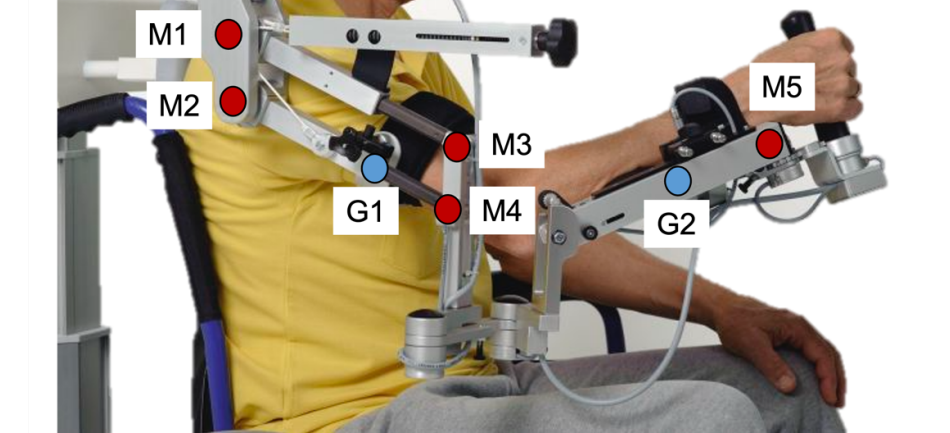

## Dati sperimentali
I dati raccolti sperimentlmente sono stati inseriti nel file  `data_stud.mat`, suddivisi in dieci matrici (numerate da `zero` a `nove`). 
Ogni matrice è composta da N righe (dove N è il numero di campioni della serie temporale) e 8 colonne:
|M1_x|M1_y|M3_x|M3_y|M4_x|M4_y|M5_x|M5_y|
|----|----|----|----|----|----|----|----|
|Coordinate x marker M1|Coordinate y marker M1|Coordinate x marker M3|Coordinate y marker M3|Coordinate x marker M4|Coordinate y marker M4|Coordinate x marker M5|Coordinate y marker M5|

**N.B.**: i dati sono stati raccolti con una frequenza di **20Hz** e e coordinate sono espresse in **[mm]**.  
Poichè le misurazioni sperimentali non sono contraddistinte da precisione assoluta, ma presentano degli errori di misurazione, i calcoli svolti su base teorica differiranno da quelli svolti sulla base dei dati sperimentali.

## Schema cinematico

### Rappresentazione grafica

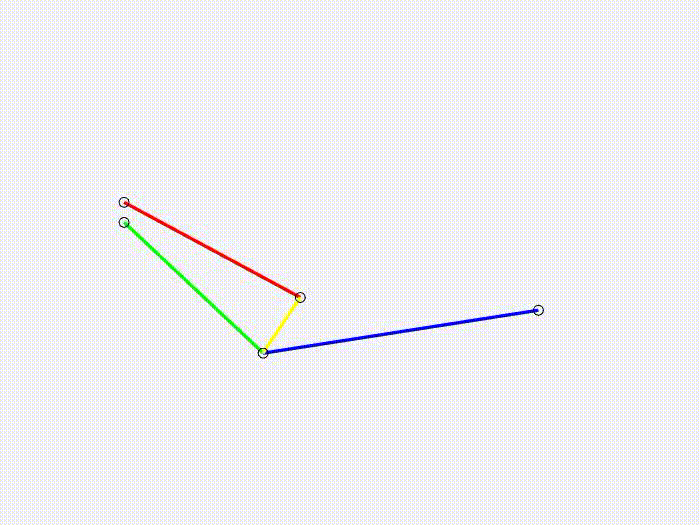

### Gradi di libertà
Il sistema è composto da **tre corpi rigidi** (sarebbero quattro, ma consideriamo un movimento solidale dei tratti M2-M4 ed M4-M5), caratterizzati ciascuno da 3 GDL, per un totale di **9 GDL**. 
Le **cerinere a terra** (in corrispondenza di M1 ed M2), **tolgono 2 GDL ciascuna**, poichè consentono la sola rotazione delle due aste incernierate. 
Le **cerniere mobili** tra le due aste (in corrispondenza di M3 ed M4), **tolgono 2 GDL ciascuna**, poichè vincolano le due aste incernierate a muoversi solidalmente. 
**Il sistema presenta quindi 1 GDL**.

## Analisi cinematica

### Storia temporale del marker M2
È possibile calcolare le coordinate del marker M2 per ogni istante di campionamento sapendo che la coordinata x risulta la stessa del marker M1, mentre la coordinata y è la coordinata y del marker M1 diminuita di 24mm.

### Lunghezze M1-M2, M1-M3, M2-M4 e M3-M4
Conoscendo la posizione dei punti istante per istante e applicando il teorema di Pitagora, è possibile ricavare la lunghezza dei segmenti. 
Tutte le misurazioni reali presentano degli errori di misurazione, per questo motivo, calcolando la lunghezza dei segmenti per ogni istante di tempo, risulteranno valori più o meno diversi in base alla dimensione dell'errore. In generale si potrebbero selezionare tre diversi valori di lunghezza: il valore minimo, il valore medio o il valore massimo tra i valori calcolati.

### Traiettoria sperimentale dei punti acquisiti
Plottando le posizioni dei punti relative a tutti gli istanti di tempo campionati si ottengono le traiettorie dei vari marker.

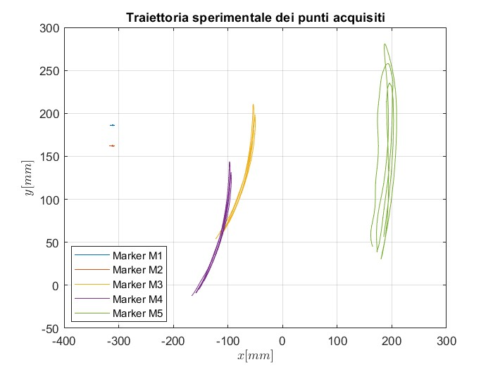

Si può notare come i marker M1 ed M2 risultino, con un'ottima approssimazione, fermi. Nella realtà, infatti, tali marker sono stati applicati in corrispondenza delle due cerniere a cui è agganciato il supporto per il braccio, che risultano macroscopicamente fermi. I marker M3 ed M4 percorrono due archi di circonferenza centrati rispettivamente in corrispondenza dei marker M1 ed M2. La traiettoria del marker M5, invece, risulta approsimativamente un arco di circonferenza, ma è visibilmente diversa. Questo è dovuto al movimento effettivo che è stato svolto durante il campionamento. Si evince, quindi, che il soggetto non è stato in grado di mantenere perfettamente fermo l'avambraccio rispetto al braccio.

### Posizione e traiettoria dei baricentri G1 e G2
Servendosi delle tabelle antropometriche, è possibile calcolare la posizione dei barecentri G1 e G2, realitivi rispettivamente alle aste M2-M4 ed M4-M5.

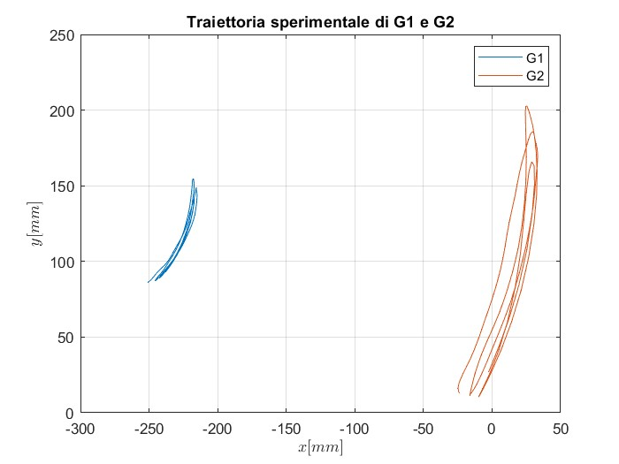

Si può notare come le traiettorie risultino simili, rispettivamente, alle traiettorie dei punti M4 ed M5, anche se ricalcano approssimativamente due archi di circonferenza con raggi inferiori, poichè i baricentri si trovano ad una distanza inferiore dal centro di rotazione rispetto ai due marker.

### Range of motion della spalla
Per calcolare il range of motion della spalla si può definire l'angolo (), che il segmento M2M4 (il braccio) forma con la verticale, istante per istante. Per effettuare questa operazione è possibile ricorrere al prodotto scalare. Si selezionano infine i valori massimo e minimo di  e se ne fa la differenza.

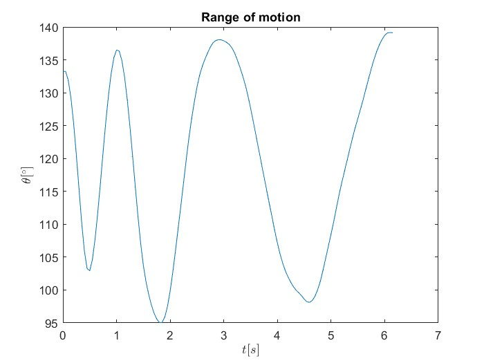

### Velocità e accelerazione di M4
Poichè la velocità risulta essere la derivata della posizione e l'accelerazione la derivata della velocità, conoscendo la posizione del marker M4 per ogni istante di tempo, è possibile ricavare i valori della velocità e dell'acelerazione di tale punto sfruttando la definizione di derivata.

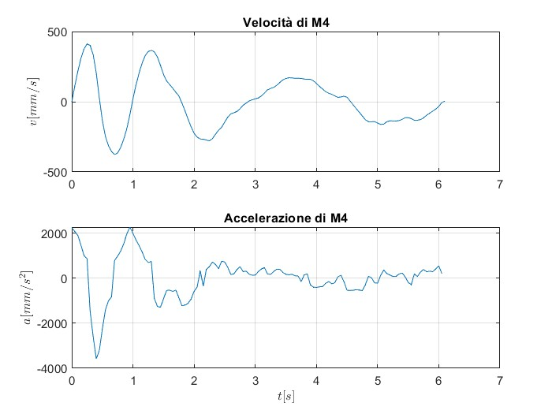

### Risoluzione del cinematismo
Conoscendo velocità e accelerazione del marker M4 è possibile risolvere il cinematismo mediante il metodo della chiusura cinematica.

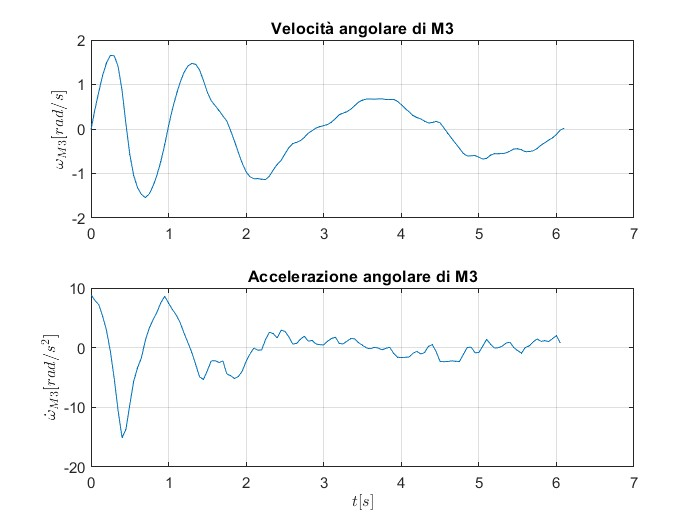

Poiché braccio e avambraccio si muovono solidalmente, la velocità e l'accelerazione angolare dei due tratti sono le medesime.

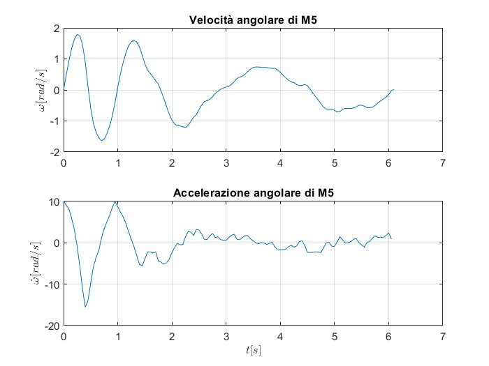

### Confronto teorico-sperimentale di velocità e accelerazione angolari di M5
Conoscendo velocità e accelerazione di M5 è possibile ricavare la velocità e l'accelerazione angolare di M5 (rispetto al suo centro di rotazione M2) mediante il rapporto tra velocità lineare e lunghezza del segmento M2M5 e derivando la velocità trovata per ricavare l'accelerazione.

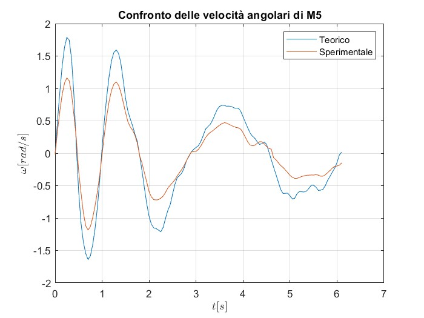

Dalla figura si può vedere come le due curve presentano un andamento simile, anche se presentano due ampiezze diverse. Queste differenze sono dovute all'errore dovuto all'incapacità del soggetto di mantenere perfettamente fermo l'avambraccio rispetto al braccio durante il campionamento dei dati.

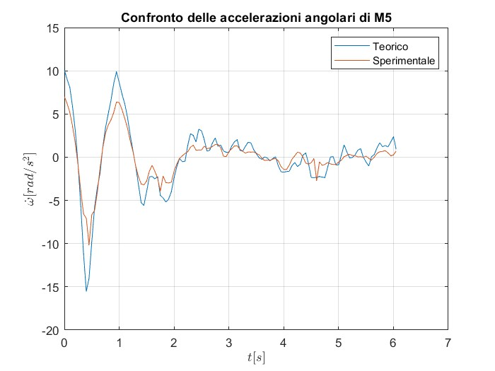

Le stesse considerazione fatte per le velocità angolari risultano valide anche per le accelerazioni.

## Analisi dinamica
Dalle tabelle antropometriche è possibile ricavare le masse di braccio, avambraccio e mano e i raggi giratori di braccio (segmento M2M4) e avmbraccio (segmento M4M5), che servono per calcolare i momenti d'inerzia degli stessi. 
Si seleziona poi l'atto di moto con il braccio in salita e l'angolo minore rispetto all'orizzontale.

  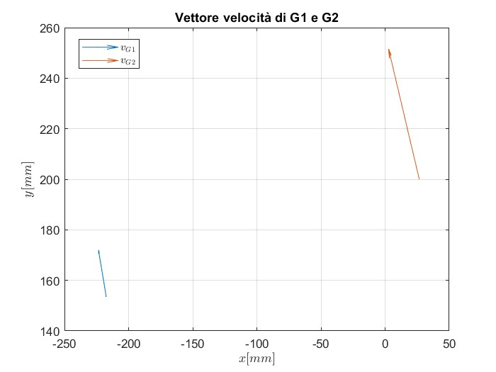
  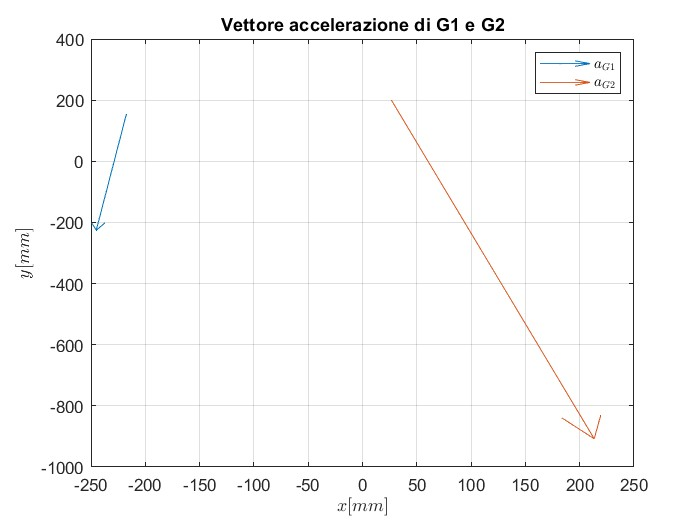

Per calcolare le coppie muscolari esercitate dai muscoli flessori () e dai muscoli estensori () è possibile ricorrere all'equilibrio tra le forze e tra i momenti. 
Si ipotizza un contributo normalizzato dei muscoli estensori pari al 10% dei muscoli flessori (per stabilità dell’articolazione) durante la flessione e viceversa.

### Coppia muscolare con supporto antigravitario
|Cf|Ce|
|----|----|
|-0.9523 Nm|-0.0952 Nm|

È possibile notare che i moduli delle due coppie risultano essere piccoli, infatti il supporto antigravitario elimina la gravità, che costituisce la componente principale da vinciere per il sollevamento del braccio. 
Un altro risultato rilevante è il segno delle due coppie, che risulta essere negativo. Questo risultato è apparentemente in contrasto con la fisica del movimento e, in parte, lo è, poichè i muscoli antagonisti, contraendosi, generano le coppie sempre negli stessi versi (quelli indicati in figura). Questo risultato può essere spiegato riflettendo sul verso delle velocità e delle accelerazioni. Nell'atto di moto considerato, infatti, il braccio risulta essere in salita, infatti le velocità sono rivolte verso l'alto (come si evince dalla rappresentazione dei vettori velocità dei baricentri), ma le accelerazioni sono rivolte verso il basso (come si evince dalla rappresentazione dei vettori accelerazione dei baricentri), ciò significa che si ha un moto decelerato. In queste condizioni, poichè la gravità è completamente bilanciata dal supporto antigravitario, sono i muscoli stessi ad opporsi al moto, generando un contributo totale nel verso opposto a quello del moto (da qui il segno meno). Nella realtà saranno quindi i muscoli estensori a fornire un contributo maggiore rispetto a quelli flessori. Se si considerasse un contributo normalizzato dei muscoli flessori pari al 10% dei muscoli estensori (caso opposto a quello consideranto nello svolgimento del progetto), infatti, le due coppie risulterebbero avere medisimi moduli ma versi opposti (segni positivi).

### Coppia muscolare senza supporto antigravitario
|Cf_g|Ce_g|
|----|----|
|6.8792 Nm|0.6879 Nm|

Le coppie calcolate senza il supporto antigravitario risultano essere circa sette volte maggiori rispetto a quelle calcolate precedentemente e positive. In queste condizioni, infatti, i muscoli dovranno fare uno sforzo maggiore per compiere lo stesso movimento. Il segno risulta essere, giustamente, positivo, poichè in questo caso è presente la gravità, che si oppone naturalmente al moto del braccio in salita, quindi ai muscoli basterà generare delle coppie più piccole in modulo per dare vita ad una decelerazione.

### Reazioni vincolari in M1 e M2 con aggancio alla carrozzina
|H1_s1|V1_s1|H2_s1|V2_s1|
|-----|-----|-----|-----|
|0 N|0 N|0.3908 N|32.5868 N|

### Reazioni vincolari in M1 e M2 con aggancio alla carrozzina e con soggetto di 90Kg
|H1_s2|V1_s2|H2_s2|V2_s2|
|-----|-----|-----|-----|
|0 N|0 N|0.5766 N|48.0789 N|

## Analisi delle vibrazioni
Per fornire al paziente un feedback che sia in grado di indicare l’avvenuta interazione con oggetti durante gli esercizi mediati da exergames si vuole utilizzare una vibrazione a livello dell’end-effector. Si è considerato una modellazione semplificata del “grip module”, sezione del dispositivo che genera la vibrazione:

### 
