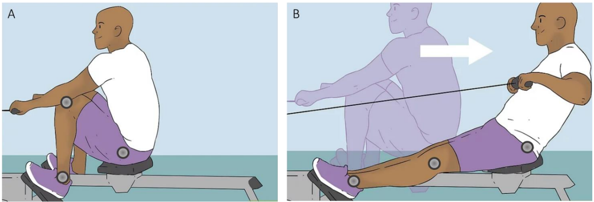
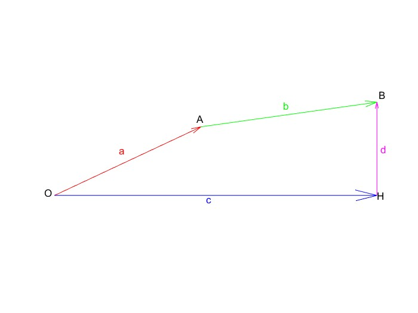

# Rowing machine

## Descrizione del sistema

La rowing machine (vogatore, in italiano),  è un attrezzo chiamato anche remoergometro che riproduce il gesto che il canottiere compie in canoa o in barca e permette di allenare tutto il corpo (stimola fino all’80% dei muscoli di chi lo esegue). 

Prima di effettuare un esercizio con il vogatore, bisogna bloccare i piedi con le apposite cinghie sulla base di appoggio. La posizione di partenza (Figura A) si assume piegando le ginocchia finché il corpo non si trova vicino alle barre montate sulla parte frontale della macchina e si afferrano le barre con entrambe le mani. L’esercizio (vogata) consiste poi nel coordinare gambe e le braccia, mentre si spingono i piedi sulla pedana di appoggio, sfruttando la forza dei muscoli delle gambe (Figura B). Nello svolgimento di questo progetto, per semplificare l’analisi, so è considerato solamente il moto delle gambe.

## Set-up sperimentale

Per raccogliere informazioni sulla cinematica del movimento durante la vogata, utilizziamo il sistema ottico Polaris Vicra, che si avvale della ricostruzione tridimensionale della posizione di marker retroriflettenti passivi ([dettagli](.././Lezione%204/appunti.md#polaris-vicra)). Il Polaris Vicra, in particolare, si avvale dell’utilizzo di gruppi di marker passivi (tools) che permettono, grazie ad una geometria pre-definita, un riconoscimento automatico del tool all’interno dell’immagine acquisita dalle telecamere. I tool devono essere posizionati in punti strategici utili per la ricostruzione del movimento di interesse. In questo caso, i 3 tool sono stati posizionati in corrispondenza di:
- anca
- ginocchio
- caviglia

## Dati sperimentali

I dati raccolti sperimentlmente sono stati inseriti nel file  `data_stud.mat`, suddivisi in dieci matrici (numerate dalla `zero` alla `nove`). 
Ogni matrice è composta da N righe (dove N è il numero di campioni della serie temporale) e 6 colonne:
|Anca x|Anca y|Ginocchio x|Ginocchio y|Caviglia x|Caviglia y|
|------|------|-----------|-----------|----------|----------|
|Coordinate x marker anca|Coordinate y marker anca|Coordinate x marker ginocchio|Coordinate y marker ginocchio|Coordinate x marker caviglia|Coordinate y marker caviglia|

**N.B.**: i dati sono stati raccolti con una frequenza di **20Hz** e e coordinate sono espresse in **[mm]**.  
Poichè le misurazioni sperimentali non sono contraddistinte da precisione assoluta, ma presentano degli errori di misurazione, i calcoli svolti su base teorica differiranno da quelli svolti sulla base dei dati sperimentali.

## Schema cinematico

### Rappresentazione grafica

### Gradi di libertà

Il sistema è composto da **due corpi rigidi**, caratterizzati ciascuno da 3 GDL, per un totale di **6 GDL**. 
La **cerinera a terra** (in corrispondenza della caviglia), **toglie 2 GDL**, poichè consente la sola rotazione della prima asta. 
La **cerniera mobile** tra le due aste (in corrispondenza del ginocchio), **toglie 2 GDL**, poichè vincola le due aste a muoversi solidalmente. 
Il **carrello** (in corrispondenza dell'anca), **tolgie 1 GDL**, poichè consente la rotazione, ma limita la traslazione in una sola direzione. 
**Il sistema presenta quindi 1 GDL**.

## Analisi cinematica

### Lunghezza delle sezioni prossimale e distale

Per calcolare la lunghezza delle sezioni prossimale (tra anca e ginocchio) e distale (tra ginocchio e caviglia), è possibile applicare il teorema di Pitagora tra le componenti x e le componenti y di ciascuna sezione, date dalla differenza tra le coordinate x e y dei rispettivi estremi (anca, ginocchio e caviglia). Poichè le posizioni dei tre punti significativi variano nel tempo, è possibile effettuare questa operazione per N volte, selezionando, infine, il valore maggiore tra tutti quelli calcolati.  
**N.B.**: La scelta di selezionare il valore maggiore è una scelta arbitraria, si sarebbe potuto decidere di considerare il valore medio o il valore minore.

### Range of motion

Per calcolare il range of motion, ovvero l'escursione angolare, del ginocchio è necessario calcolare l'angolo formato dalle due aste (che rappresentano le sezioni prossimale e distale della gamba), selezionare l'angolo massimo e quello minimo e farne la differenza. 

### Velocità e accelerazione dell'anca

La velocità e l'accelerazione assoluta dell'anca (punto B nello [schema cinematico](./report.md#rappresentazione-grafica)) sono entrambe dirette orizzontalmente a causa del vincolo di carrello, posto proprio in corrispondenza dell'estremo B dell'asta AB (sezione prossimale della gamba). 
Per calcolare le suddette grandezze in ogni istante di tempo, partendo dai dati sperimentali, è possibile sfruttare la definizione di derivata temporale calcolando il rapporto tra la differenza tra la coordinata x dell'anca nell'istante seguente a quello considerato e quella nell'istante cosiderato e l'intervallo di tempo dt. In questo modo, tramite un ciclo `for`, è possibile creare un vettore di velocità e accelerazioni istantanee dell'anca in ogni istante di tempo. 

### Risoluzione teorica del cinematismo

Dal punto di vista teorico è possibile risolvere il cinematismo utilizzando il metodo della chiusura cinematica. 

 
Innanzitutto è necessario definire gli angoli $\alpha$ e $\beta$ , che le due aste formano con l'orizzontale per ogni istante di tempo. Successivamente, conoscendo le velocità istantanee dell'anca (punto B), si può calcolare il vettore delle accelerazioni angolari, contenente i valori delle accelerazioni angolari delle due aste per ogni istante di tempo, risolvendo il sistema lineare di due equazioni in due incognite derivante dalla derivazione dele equazioni della chiusura cinematica. Derivando le due equazioni del sistema risolto precedentemente si ottengono altre due equazioni in due incognite, che sono le accelerazioni angolari delle due aste. Risolvendo questo sistema per ogni istante di tempo, si ricavano i vettori contenenti i valori delle accelereazioni angolari delle due aste per ogni istante di tempo. 

### Confronto tra risoluzione teorica e dati sperimentali

